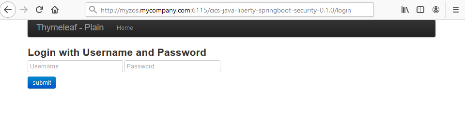
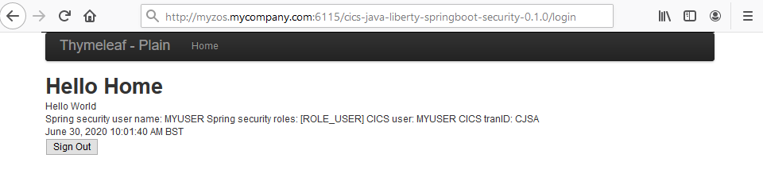

# Spring Boot Java applications for CICS - Part 2 - Security


## Learning objectives

If you're deploying a Spring Boot application into Liberty running in CICS, then security is an area you'll definitely want to consider. 
Spring, Liberty and CICS all offer powerful options for security, so you need work out which ones to choose, and how they'll work together. 
In this tutorial we will explain three different options:
1. The first is to continue to use Java EE security using a `web.mxl`. This offers the ability to use standard Liberty authentication and authorisation mechanisms, but does not support method level authorisation.
1. The second is to use pure Spring Security without integrating with Liberty or CICS security. This could be useful if you're taking an existing Spring Boot application and deploying it in CICS. It probably won't require any changes to the application. 
1. The third option is to integrate Spring Security with Liberty security. This is useful if you want to integrate SAF role authorization into your application.

The sample code for this tutorial can be found here in this CICSDev Git repo [cics-java-liberty-springboot-security](https://github.com/cicsdev/cics-java-liberty-springboot-security)

## Prerequisites

- CICS TS V5.3 or later.
- A configured Liberty JVM server in CICS.
- Java SE 1.8 on the z/OS system.
- Java SE 1.8 on the workstation.
- An Eclipse development environment on the workstation.
- Either Gradle or Apache Maven on the workstation.

This tutorial assumes that your Spring Boot application is packaged as a deployable WAR. 
This means you must have a class that extends `SpringBootServletInitializer` (normally your main application class), and declares the embedded web container as a provided dependency in your build script.
For further details refer to this tutorial [Spring Boot Java applications for CICS, Part 1: JCICS, Gradle, and Maven](https://developer.ibm.com/technologies/java/tutorials/spring-boot-java-applications-for-cics-part-1-jcics-maven-gradle).  

The sample uses the Thymeleaf template framework for creation of HTML based pages with dynamic fields which are populated by the sample code. A Bootstrap CSS template is used to create the navigation bar in the Home page of the application.


## Estimated time
It should take you about 1 hour to complete this tutorial.


## 1. Using Java EE Security
<a name="part1"></a>

If you are familiar with Java EE security in Liberty, and wish to just use basic, form, or certificate based authentication, then you can use the same mechanism with Spring Boot applications deployed in Liberty.
This allows you to use Liberty security to authenticate users, and either CICS transaction security or Liberty SAF authorisation to authorise access to applications. However, you will not be able to use `@RolesAllowed` annotations
in the Spring Boot application  to control authorizations at the method level, as a Spring Boot application is not a servlet.  

The following `web.xml` should be placed in the `src/main/webapp/WEB-INF/` folder of your Spring Boot project. 
The specified security constraint protects all URLs via the `<url-pattern>/*</url-pattern>` and uses HTTP basic authentication to request a userid and password. 
Authorisation is limited to the users in the role `ROLE_USER`.
```xml
<?xml version="1.0" encoding="UTF-8"?>
<web-app xmlns="http://java.sun.com/xml/ns/javaee"
    xmlns:xsi="http://www.w3.org/2001/XMLSchema-instance"
    xsi:schemaLocation="http://java.sun.com/xml/ns/javaee http://java.sun.com/xml/ns/javaee/web-app_3_0.xsd"
    version="3.0">
    <display-name>cics-java-liberty-springboot-security</display-name>
    <login-config>
        <auth-method>BASIC</auth-method>
    </login-config>
    <security-constraint>
        <web-resource-collection>
            <web-resource-name>Secured Areas</web-resource-name>
                <url-pattern>/*</url-pattern>
        </web-resource-collection>
        <auth-constraint>
            <role-name>ROLE_USER</role-name>
        </auth-constraint>
    </security-constraint>
    <security-role>
        <role-name>ROLE_USER</role-name>
    </security-role>
</web-app>
```

In order to deploy your Spring Boot application with Java EE security, you'll need to configure a user registry and authorization method in the Liberty `server.xml` configuration file.

If you don't yet have a Liberty JVM server configured, using CICS auto-configuration is a great way to start. 
If you enable auto-configuration in the JVM profile, it will generate a basic `server.xml` when the JVM server is enabled. 
When CICS security is enabled (`SEC=YES` is specified in the SIT), it will add almost everything you need. 
This includes the required Liberty features, and the `<safRegistry>` element, along with configuration of the Liberty angel process as described in this tutorial [Using the Liberty angel to access authorized z/OS services](https://community.ibm.com/community/user/ibmz-and-linuxone/blogs/philip-wakelin1/2020/08/10/liberty-angel-to-access-authorized-services). 

If you're customizing an existing configuration, you'll need to make sure you include the following:

* CICS features `cicsts:core-1.0` and `cicsts:security-1.0` 
* Registry configuration such as `<safRegistry>` 
* An application element for the deployed application

Here's a complete `server.xml` example. Here we've used Java EE roles for authorisation, mapping `ROLE_USER` to the SAF user ID, `MYUSER`. So this is the only user who will be allowed access to the application.
```xml
<?xml version="1.0" encoding="UTF-8"?><server description="CICS Liberty sample configuration">
<!-- Enable features -->
<featureManager>
    <feature>cicsts:core-1.0</feature>
    <feature>cicsts:security-1.0</feature>
    <feature>servlet-3.1</feature>
</featureManager>

<httpEndpoint host="*" httpPort="28221" id="defaultHttpEndpoint"/>

<applicationMonitor dropins="dropins" dropinsEnabled="false" pollingRate="5s" updateTrigger="disabled"/>   
<safRegistry enableFailover="false" id="saf"/>
	
<application location="${server.config.dir}/cics-java-liberty-springboot-security-0.1.0.war" type="war">
    <application-bnd>
        <security-role name="ROLE_USER">
            <user name="MYUSER"/>
        </security-role>
    </application-bnd>
</application>
</server>
```

Alternatively you can configure authorisation using SAF role mapping and EJBROLE profiles. For more information, see Authorization using SAF role mapping in the [IBM CICS Knowledge Center](https://www.ibm.com/support/knowledgecenter/SSGMCP_5.6.0/security/java/jee_app_role.html)


## 2. Using pure Spring Security

If you've got an existing Spring Boot application and are happy with its current security model, and do not need to integrate with any CICS security, you might not need to make any changes to the application. 
When you run your Spring Boot application in CICS, [Spring Security](https://spring.io/projects/spring-security) will continue to work exactly as before, and can still handle authentication and authorization. 
Java EE security doesn't get involved at all, and none of the Liberty security configuration will affect your application, with the exception of SSL configuration for the endpoint. 
However, if you don't take any action, work in CICS will run under the CICS default user ID, configured by the CICS `DFLTUSER` [SIT parameter](https://www.ibm.com/support/knowledgecenter/SSGMCP_5.6.0/reference/sit/dfha2_dfltuser.html). 
This isn't a great idea, as the default user should not have access to CJSA, the default transaction for work coming in through Liberty. 
In addition, you'll see the following warning message in the Liberty messages.log for every request: 
```
CWWKE0700W: [com.ibm.cics.wlp.security.zos] [CICSThreadIdentityServiceImpl] @Warning: set() - SJJS SWITCH_PTHREAD_CONTEXT, user ID ' ' does not exist in SAF - CICS transaction will run under the CICS DEFAULT user ID.
```

To avoid this you can create a CICS URIMAP resource defintion, mapping requests to a more specific transaction and user ID. You could create multiple URIMAPs for different parts of your application, 
for example matching URLs with the path `/admin` to a different user ID in CICS. For more information about defining URIMAPs for Liberty applications, see the procedure in 
[Authorizing users to run applications in a Liberty JVM server](https://www.ibm.com/support/knowledgecenter/SSGMCP_5.6.0/security/java/auth_app_liberty.html) in the IBM CICS Knowledge Center.

## 3. Integrating Spring Security with Java EE security

A key advantage to deploying a Spring Boot application in Liberty is the ability to integrate with CICS and Liberty security. 
If you've already got other web applications deployed in Liberty, you can share the same authentication and authorization methods. 
However, you might still want to take advantage of Spring Security, perhaps for the ease of defining role-based access to individual URLs, or to use method level security. 
The good news is that it's entirely possible to integrate Spring Security and Java EE security, and therefore get integration with Liberty and CICS security as well. 
This can be done with a few simple modifications to your application. You can use any supported means of authentication and authorization in Liberty, and the user ID used to login is propagated to the CICS task. 
This means you can use CICS transaction and resource security. 

### Pre-authentication in Spring Security

Spring Security supports pre-authentication, the ability to authenticate users by some other means. This will provide a valid user ID and set of roles. 
Spring provides configuration options to use the Java EE container pre-authentication which is [described in their documentation](https://docs.spring.io/spring-security/site/docs/5.2.0.RELEASE/reference/html/jc-authentication.html#java-ee-container-authentication). We'll use this mechanism to integrate with Liberty security. By doing this, Liberty will handle authentication and authorization as for any other web application. Spring Security will also receive the user ID and set of authorized roles. It works by picking up the Principal associated with the servlet request, and calls [isUserInRole()](https://docs.oracle.com/javaee/6/api/javax/servlet/http/HttpServletRequest.html#isUserInRole(java.lang.String)) for each of a predefined set of roles. To demonstrate this, there is a sample on [GitHub](https://github.com/cicsdev). This takes a [simple Spring Boot application](https://github.com/spring-projects/spring-boot/tree/master/spring-boot-tests/spring-boot-smoke-tests/spring-boot-smoke-test-web-secure) with security and adds Java EE container preauthentication based on the [Spring Security sample](https://github.com/spring-projects/spring-security/tree/master/samples/javaconfig/preauth). 
The sample presents a single page which is only accessible to those who have access to the role ROLE_USER. The page displays the authenticated user and their roles, and the CICS user ID and transaction when running in a CICS environment. 
We will discuss the steps necessary to set up Spring Security to achieve this, how to configure Liberty, and how to deploy the application.

### Configuring Spring Security

It's simple to add Java EE pre-authentication to your Spring Security configuration. You'll need an `@Configuration` class that extends `WebSecurityConfigurerAdapter` that looks something like the following. 
In our provided sample applicaiton this can be found in the [Application.java](https://github.com/cicsdev/cics-java-liberty-springboot-security/blob/master/src/main/java/com/ibm/cicsdev/springboot/security/Application.java).

```java
@EnableWebSecurity
@Configuration
protected static class ApplicationSecurity extends WebSecurityConfigurerAdapter {
 
    @Override
    protected void configure(HttpSecurity http) throws Exception {
        http
            .csrf().disable()
            .authorizeRequests()
                .antMatchers("/login", "/resources/**", "/j_security_check","css/**").permitAll()
                .anyRequest().authenticated()
                .and()
           .jee().mappableRoles("USER", "ADMIN");
        }
    }
}
```

Java EE preauthentication is enabled by calling [HttpSecurity.jee()](https://docs.spring.io/spring-security/site/docs/current/api/org/springframework/security/config/annotation/web/builders/HttpSecurity.html#jee--). 
You can chain this onto the end of any existing Spring Security configuration. 
You need to provide a list of the roles that you want propagated into Spring Security, which should match those defined in `web.xml`. 
You don't need to configure the actual authentication method here (e.g. basic authentication). 
However, if you're using form login for authentication as we have in the sample, then it will be necessary to explicitly permit unauthenticated access to `j_security_check`. 
This is the URL that form credentials are POSTed to in Java EE. Without this, you'll get a 403 from Spring Security when the user submits the login form. 
You also need to allow access to any other URLs that users require access to in order to log in, such as `/login` and any resources used in the login page.

### web.xml configuration

You'll need to configure security in `web.xml`, the web application deployment descriptor, in the same way as you would for a normal Java EE application. 
In our sample project the following [web.xml](https://github.com/cicsdev/cics-java-liberty-springboot-security/blob/master/src/main/webapp/WEB-INF/web.xml) can be found in `src/main/webapp/WEB-INF` folder.
```xml
<web-app version="2.5" xmlns="http://java.sun.com/xml/ns/javaee"
    xmlns:xsi="http://www.w3.org/2001/XMLSchema-instance"
    xsi:schemaLocation="http://java.sun.com/xml/ns/javaee https://java.sun.com/xml/ns/javaee/web-app_2_5.xsd"> 
    <login-config>
        <auth-method>FORM</auth-method>
        <form-login-config>
            <form-login-page>/login</form-login-page>
            <form-error-page>/login?error</form-error-page>
        </form-login-config>
    </login-config>
 
    <security-role>
        <role-name>ROLE_USER</role-name>
    </security-role>
    <security-constraint>
        <web-resource-collection>
        <web-resource-name>Public</web-resource-name>
            <description>Matches unconstrained pages</description>
            <url-pattern>/login</url-pattern>
            <url-pattern>/logout</url-pattern>
            <url-pattern>/resources/*</url-pattern>
            <url-pattern>/css/*</url-pattern>
        </web-resource-collection>
    </security-constraint>
    <security-constraint>
        <web-resource-collection>
            <web-resource-name>Secured Areas</web-resource-name>
            <url-pattern>/*</url-pattern>
        </web-resource-collection>
        <auth-constraint>
            <role-name>ROLE_USER</role-name>
        </auth-constraint>
    </security-constraint>
</web-app>
```

This uses the standard Java EE format for defining the authentication method, roles, and what roles are required for each URL. 
Here we've used form authentication, defining a single role called `ROLE_USER`, which has access to the whole application. 
In addition, unauthenticated users are granted access to a subset of URLs to allow them to log in. This should match the list in the Spring Security configuration. 


### Liberty configuration

To deploy the sample into a CICS Liberty JVM server you will need to first build build the application as a WAR. Maven [pom.xml](https://github.com/cicsdev/cics-java-liberty-springboot-jcics/blob/master/pom.xml) and Gradle [build.gradle](https://github.com/cicsdev/cics-java-liberty-springboot-jcics/blob/master/build.gradle) files are provided in the 
sample Git repository to simplify this task. You will then need to 

* Configure your CICS Liberty JVM server to use a SAF user registry
* Define the application to the Liberty server using an `<application>` element in the Liberty `server.xml` just as we did for [scenario 1](#part1) 
* Configure an authorization method, using either Java EE roles or EJBROLE profiles defined in SAF.
* Start the Liberty server and login to the application using the login form on the landing page as shown.
    
 


The *Hello Home* page below should be returned with details of the Spring Security user name and roles, and the CICS transaction ID and task user ID. 
If Spring security integration is working correctly the Spring Security user should be the same as the CICS user ID.
    
 


### Debugging

Debugging security configuration can be a tricky business, and it's even more tricky when two security models are involved. 
In particular, if you see an HTTP error code like 403 Forbidden, it's not always obvious whether it's coming from Liberty itself or from Spring Security. 
Testing the application on your workstation can help reduce the time taken to make changes and try out alternatives. 
There are a number of ways to download and install Liberty, [described here](https://developer.ibm.com/wasdev/downloads/#asset/runtimes-wlp-webProfile8). 
Of course you won't be able to try out integration with SAF security when running on your workstation, however you can use a basic registry instead. For example: 
```xml
<basicRegistry>
    <user name="Fred" password="password"/>
    <user name="Bob" password="password"/>
</basicRegistry>
 ```
  
 This configures a couple of users you can map to roles to try things out. It will allow you to test your Spring Security configuration, and ensure it's receiving credentials from Liberty. 
 Of course, a basic registry should not be used in production. Also, bear in mind you'll only be able to test parts of the application that don't use the JCICS API, as this is only available when running in CICS. 
 Spring Security provides comprehensive debugging information. To enable this, put `@EnableWebSecurity(debug = true)` in your security configuration class. 
 Also, add `logging.level.org.springframework.security: DEBUG` to your application.properties file. 
 Spring Security will then produce verbose logging on each request. This should help you identify exactly which security check led to an error.

## Summary

Running your Spring Boot application in CICS gives many options for integrating with existing CICS and Liberty security, whilst at the same time allowing you to use either Java EE security or Spring Security to 
combine the two together. 


## References
* [CICSDev Git repo cics-java-liberty-springboot-security](https://github.com/cicsdev/cics-java-liberty-springboot-security) - The CICSDev sample for this tutorial.
* [CICSDev Git repo cics-java-liberty-springboot-jcics](https://github.ibm.com/cicsdev/cics-java-liberty-springboot-jcics) - A CICS Liberty Spring Boot sample.
* [Liberty in IBM CICS: Deploying and Managing Java EE Applications](http://www.redbooks.ibm.com/abstracts/sg248418.html?Open&pdfbookmark) - This IBM Redbooks publication walks through everything you need to know about deploying applications in Liberty in CICS. Chapter 7 focuses on security, and discusses all the options with complete examples.
* [Spring Security Reference](https://docs.spring.io/spring-security/site/docs/current/reference/htmlsingle/) - Spring's detailed reference guide.
* [Java EE Container Authentication](https://docs.spring.io/spring-security/site/docs/5.2.0.RELEASE/reference/html/jc-authentication.html#java-ee-container-authentication) - Java EE security integration for Spring servlet applications.

